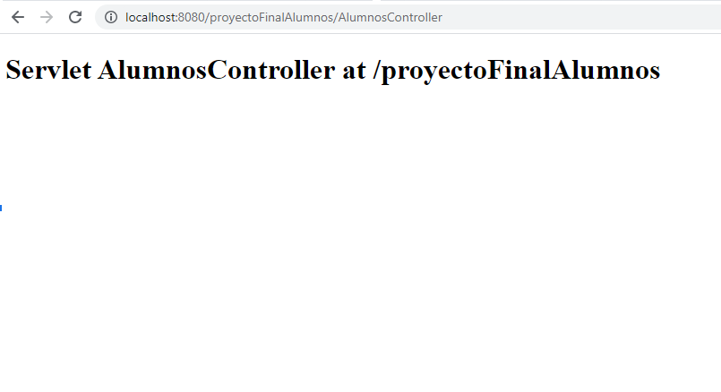
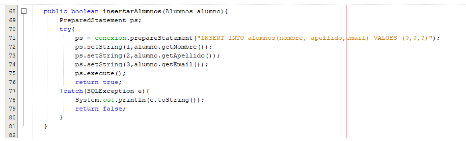

# Paso a paso para un crud con java
1. Creamos un proyecto nuevo y elegimos Maven/ Web Application

2. Agregamos el nombre a nuestro proyecto

3. Elegimos el servidor Apache Tomcat

4. Abrimos el archivo index.html que está dentro de la carpeta Web Pages y ejecutamos el proyecto, te va a pedir el usuario y contraseña de tomcat

5. Se va a abrir en el navegador después de descargar los plugins necesarios para maven de esta manera:

6. Recuerda que deberías de tener ya configurado el apache Tomcat 8 (el que viene en xampp) en tu netbeans. Si aún no lo tienes entra en Tools/Server/AddServer seleccionas Apache Tomcat or TomEE 

7. Buscas la ruta de tu xampp/Tomcat y entras en esa carpeta, pulsas sobre Open

8. Por último asignamos un usuario y una contraseña

9. Creamos una carpeta para las vistas, pulsamos el botón derecho sobre la carpeta Web Pages/New Folder y lo nombramos como Vistas

10. Dentro de la carpeta tenemos que crear 3 archivos con extensión jsp alumnos.jsp, nuevo.jsp y modificar.jsp

## Agregando clases de java y los Servlets

1. Generamos tres nuevos paquetes config, modelo y controlador 

2. Dentro del paquete config creamos una clase de java y la llamamos Conexion.java

3. Dentro del paquete modelo creamos dos clases Alumnos y AlumnosDAO

4. Luego por último crearemos en controlador un servlet llamado AlumnosController

5. Probemos escribiendo la ruta http://localhost:8080/proyectoFinalAlumnos/AlumnosController para verificar que está trabajando nuestro servlet de manera correcta

 

6. Creamos dentro del archivo Conexion.java una función llamada getConnection e importamos las librerías:
- java.sql.Connection
- java.sql.DriverManager
- java.sql.SQLException

 

Usamos un try catch porque vamos a usar una conexión a la base de datos con una excepción dentro del catch. 
Dentro del try creamos un objeto conexion donde vamos a almacenar el driver de la conexión usando el método getConnection y pasándole como parámetros la url que contiene la ruta, al final el nombre de la base de datos y las opciones del usuario y el password, retornamos la variable conexion. Si existe algún error usamos el el catch la excepción la imprimimos en la consola y retornamos null.

7. Dentro de nuestra archivo Alumnos.java vamos a agregar las propiedades id, nombre, apellido, email, creamos el constructor donde vamos a recibir los mismos datos ( id, nombre, apellido, email)  y les creamos los geters y seters, para ello pulsamos con el botón derecho sobre el archivo Insert Code y seleccionamos getters and Setters los seleccionamos todos.

8. Abrimos el archivo pom.xml y agregamos el mysql connector 8.0.25 lo pudedes conseguir acá  luego copias y luego lo pegas dentro de las etiquetas <dependencies></dependencies> 
 

9. Ahora vamos a probar crea esta función dentro de la clase Conexion y pulsamos sobre el archivo y seleccione Run 

 
10. Si todo está bien te va a mostrar lo siguiente:

## Agregando las vistas

1. Vamos al archivo alumnos.jsp 
- Agregamos el cdn de bootstrap
- Agregamos una tabla con las columnas y filas necesarias para mostrar los datos de los alumnos

 

2. Si pegamos la ruta  http://localhost:8080/proyectoFinalAlumnos/Vistas/alumnos.jsp  lo veremos de esta manera en el navegador

3. Vamos a la clase nuevo.jsp pegamos el cdn de bootstrap y vamos a crear esa vista para añadir alumnos

4. Copiamos el formulario del archivo de nuevo.jsp y lo pegamos en modificar.jsp, agregando el input del id con el type=hidden (oculto) porque ese es el que vamos a usar para hacer el insert a ese usuario

 

## Creando los métodos para el crud
1. Vamos a nuestro archivo AlumnosDAO.java (Objeto de acceso a Datos) que se encarga de suministrar una interfaz común entre nuestra aplicación y la base de datos donde vamos a crear un objeto para la conexión a la base de datos y un método para listar alumnos que lo vamos a usar para mostrar al momento de hacer una consulta en el archivo alumnos.jsp

 2. Creamos un método para mostrar el registro de un solo alumno

3. Crear otro para Añadir los alumnos nuevos

4. Otro para Actualizar que vamos a usar para recibir los datos enviados desde el archivo modificar.jsp

5. Y por último el método para eliminar un Alumno

## Creando la conexión de mi WebApp con java Controlador 

1. Vamos a nuestro archivo AlumnosController.java y borramos processRequest y los llamados en los métodos doGet y doPost y los comentarios nos quedaría así:

2. Dentro de doPost vamos a llamar a doGet esto porque usamos un solo Servlet de este modo el MVC trabajaría mejor dentro del llamado enviamos la petición y la respuesta doGet(request,response);

3. Ahora dentro de doGet vamos a realizar las siguientes instrucciones:
- Creamos una instancia de la clase AlumnosDAO esto ejecuta la conexión a la base de datos
- Creamos una variable de tipo String accion
- Creamos una variable de tipo RequestDispatcher para indicar a que vista es la que vamos a mostrar
- Le asignamos a accion los parámetros que recibimos en el request usando el método  getParameter();
- Creamos un if donde vamos a tomar las decisiones dependiendo de los parámetros recibidos a través de la url

4. Dentro del if  recibimos la ruta del inicio vamos a agregar, también agregamos al objeto dispatcher la función forward con los parámetros request y response

5. Ahora si probamos y vamos al navegador y escribimos http://localhost:8080/proyectoFinal/AlumnosController en la ruta

6. Agregamos dentro del archivo alumnos.jsp el siguiente código:
- Un objeto de tipo Alumnos y Lista (línea 48)
- Un objeto de tipo AlumnosDAO para llamar a uno de sus métodos (línea 49)
- Le asignamos al objeto resultado el retorno en este caso la lista de los alumnos que están en la base de datos  (línea 50)
- Lo recorremos con un for esa lista y vamos adicionando cada uno de los datos dentro de la tabla (líneas 56 a la 63)

7. Ahora si guardamos y presionamos F5 vamos a ver el listado de la tabla en nuestra página

- Nota: En el caso de no aparecer la lista verifica que tengas el archivo pom.xml así como el de la imagen siguiente para que puedas usar la api de los archivos servlet de Maven

8. Ahora podemos continuar dentro del archivo ALumnosController.java vamos a agregar la ruta para modificar los datos de un alumno, si pulsamos sobre la x que está dentro de la tabla en la columna Modificar vas a notar que nos va a dar un error ya que aún no se ha creado el dispatcher para recibir la petición (request) como el siguiente:

9. Si vemos la ruta vamos a notar que después de AlumnosController hay un signo de ? este se usa para completar la ruta y enviar datos en ese caso  
estamos enviando accion=modificar y el id = 1 estos parámetros los vamos a capturar con la clase dispatcher entonces agreguemos un else if

10. En el else anterior enviamos a el archivo modificar.jsp, ahora tenemos que mostrar en el formulario de esta página los datos de ese alumno para poder cambiar lo que queramos y luego usar la ruta AlumnosController?accion=actualizar ya que tenemos el id oculto lo usamos para hacer el update correspondiente. fíjate que hacemos acá:
- Capturamos los parámetros (líneas  33 hasta 36)
- Creamos un objeto de la clase Alumnos, la instanciamos con los datos (línea 38)
- Llamamos con el objeto de la clase AlumnosDAO el método para actualizar el alumno
- Redirigimos a la página de alumnos.jsp para que muestre la tabla actualizada 
 

 

11. Y ahora nos corresponde hacer el de eliminar un registro para ello usamos la ruta AlumnosController?accion=eliminar&id=" + resultado.get(i).getId();
que agregamos en el momento de crear la lista de los alumnos y está en la columna Eliminar. 

- Capturamos el id y como es String le hacemos un parseo (línea 44)
- Llamamos al método eliminarAlumno   (línea 45)
- Redirigimos a la página de alumnos.jsp para que muestre la tabla actualizada 

11. Ahora nos queda solo para agregar un nuevo alumno para ello vamos a agregar un else if para que cuando la variable accion sea igual a nuevo se dirija la ruta Vistas/nuevo.jsp 

12. Una vez que estamos en esa ruta podemos llenar el formulario para que cuando pulsamos sobre agregar en el atributo action del formulario va a usar la ruta AlumnosController?accion=insert
- Capturamos los parámetros y los guardamos en variables de tipo String (líneas 51 hasta la 53)
- Creamos un objeto de la clase Alumnos y lo instanciamos con las variables, usamos 0 en el primero porque recuerda que es auto incrementable(línea 55) 
- Por último vamos a usar el objeto alumnosDao para llamar el método insertarAlumnos

Para que no salga error si en la ruta hay algo distinto agregamos un else para volver a redirigir a la página de los alumnos

